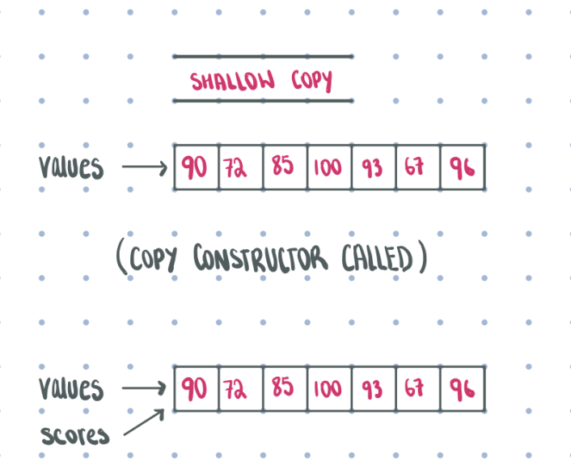
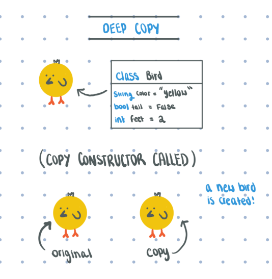

# <!-- fit --> CS 199 EMP

## <!-- fit --> Even More Practice

---

# 2 meetings every week Tuesday and Thursday

* Early CST - Early risers and Eastern timezones

* Evening CST - Western timezones (and really late Eastern folks)

* Calendar contains zoom links

* Attend 10 ones for credit. 

---

# Format

* 3 practice problems every session

* focused on practical understanding of concepts covered recently in class

* slides and material available after class

--- 

# How to follow along

* Small breakout rooms of working together 

* Work for 10-15 minutes together, feel free to use paper, whiteboards, online share tools.

* Use the code playground on the 125 homepage for the interactive running

---

# <!-- fit --> Polymorphism Casting

---

# From Tuesday: Upcasting

```java
public class Book { }
public class Fiction extends Book { }
public class Romance extends Fiction { } 
```

* Up casting is *going up* the inheritance chain. 

* `Romance` can be cast up to `Fiction`, `Book`, `Object`. `Fiction` can be cast up to `Book` and `Object`

* Everything can basically be cast into an `Object` since everything inherits from that

---

# From Teuesday: Default methods and equals use cases

* In java all objects by default have `toString()`, `hashCode()` and `equqls(Object o)` 

* They're not often that good so we override them to work as we want using `@Override`

* For all objects we use `equals()` and for all primitives/null we use `==`

---

# From Teuesday: Equals - algorithm

1. Check if `null`

2. Check if correct type using `instanceof`

3. Downcast it to the right type and then check all instance variables using a mix of `==` and `equals()`

4. Don't forget `@Override`

---
# Copycat

* Java has no built-in way to copy an object
* Complier has no way of telling how you would want to copy Objects you defined!
  * Other languages, like C++ will create a (bad) default constructor for you in the absence of a real cc
* To copy Objects, we need to build a copy constructor

```java
  Cat(Cat c) {  
      height = c.height; 
      cuteness = c.cuteness; 
  } 
```
---


---
# Shallow VS Deep copying 
```java
public class GradeBook { 

	private int[] scores; 

	public GradeBook(int[] values) { 
		scores = values; 
	}
}

```
* In a __shallow copy__ we simply copy over all the refferences to the original
* In other words, our 'copy' just reffers to the original object, nothing new is created
* This means that when the original data changes, so does the object
* A __deep copy__ will require making a new object


---
# Example
```java
public class GradeBook { 
  private int[] scores; 
  
  public GradeBook(int[] values) { 
    scores = values; 
  }
}
```
The above example actually yields the following, ```values``` and ```scores``` are both refferences to the same array:


---
# Deep Copy
A true __deep copy__ would yield the following:

---

---
# Exercise 1
Use the starter code from the GradeBook class example to fix the copy constructor to make a __deep copy__
---

---
# Starter Code
```Java
public class GradeBook { 
  private int[] scores; 
  
  public GradeBook(int[] values) { 
    scores = values; 
  }
}
```
---

# <!-- fit --> Dot Notation

---

```Java
public class Bird {
  public int wings = 0;
  public String color = "blue";
}

void color_bird(Bird canary) {
  canary.color = "yellow";
}

void redBull(Bird canary) {
  canary.wings += 2;
}

Bird bigBird = new Bird();
System.out.println(bigBird.wings);
System.out.println(bigBird.color);

color_bird(bigBird);
redBull(bigBird);

System.out.println(bigBird.wings);
System.out.println(bigBird.color);
```
---

---
# Exercise 2 (practice with dot notation)
* create a class ```Student``` with attributes ```grad_year``` and ```major```.
* create one function ```void upgrade()``` that will change an only an ECE major to a CS major
* create anoter function ```void graduate()``` that will change their grad year to 2020.
* No starter code for this one, start from scratch! ;)
---

---
# Weekly recap
* Remaining time is for you to ask questions about literally anything the class has covered so far!
* Don't hesitate :)
---

# <!-- fit --> Solutions

---

```java
public class GradeBook { 
  private int[] scores; 
  
  public GradeBook(int[] values) { 
    scores = new int[values.length];
    for (int i = 0; i < values.length; i++) {
      scores[i] = values[i];
    }
  }
}
```

---

```java
public class Student {
  private int gradYear;
  private String major;
  public class Student(int g, String m) {
    gradYear = g;
    major = m;
  }

  public void upgrade() {
    if (major.equals("ECE")) {
      major = "CS";
    }
  }

  public void graduate() {
    gradYear = 2020;
  }
}
```