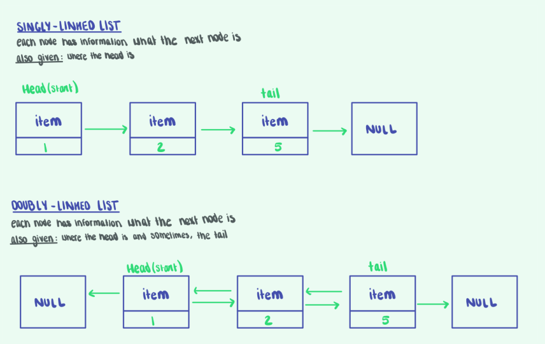

# <!-- fit --> CS 199 EMP

## <!-- fit --> Even More Practice

---

# <!-- fit --> Attendance Link:

https://forms.gle/8yto1LvJ4hntiKNu7

---

# 2 meetings every week Tuesday and Thursday

* Early CST - Early risers and Eastern timezones

* Evening CST - Western timezones (and really late Eastern folks)

* Calendar contains zoom links

* Attend 10 sessions for credit, attendence via google form.

---

# Format

* 3 practice problems every session

* focused on practical understanding of concepts covered recently in class

* slides and material available after both sessions

--- 

# How to follow along:

* Small breakout rooms of working together 

* Work for 10-15 minutes together, feel free to use paper, whiteboards, online share tools.

* Use the code playground on the 125 homepage for the interactive running


---

# Review from last week: Time Complexity

* We use Big O notation to describe the time complexity of how the time taken by algorithms scale.

* Typically we (and interviewers) are looking for the worst case complexity.

* Constants don't matter $O(n)$ ~ $O(5n)$ ~ $O(41525235n)$

* $O(1)$ - constant time - the number of operations stays about the same

* $O(log n)$ - logarithmc time - the number of operations incrases in a $log$ pattern.

* $O(n)$ - linear time - the number of operations scales linearly

* $O(n^2)$ - quadratic time - the number of operations scales with the square

---

# Review from last week: Linked Lists

Let's take a closer look at the ```SimpleLinkedList``` from lecture:

```java
public class SimpleLinkedList implements SimpleList {

  private class Item {
    private Object value;  // holds the value of the item
    private Item next;     // tells you what the next value in the list
    
    Item(Object setValue, Item setNext) {
      value = setValue;
      next = setNext;
    }
  }
```


---
# It looks a lot like this: 



---
# Problem 1: Linked List Insert
Given the location of the head of a linked list, an (int) index to insert at and a value, insert a new node with the given value at the given position. **give runtime as well**

```Java
public class Node {
  public int value;
  public Node next;

  Node(Node setValue, Node setNext) {
    value = setValue;
    next = setNext;
  }
}

insertAt(Node head, int data, int position) {
}
```

I want you all to draw out a linked list and show what inserting might look like.

---

# What else can we make with lists?
Linked Lists are really usefull for implementing data structures like ```stacks``` and ```queues```

**queue** FIFO (First in, first out)
https://www.geeksforgeeks.org/queue-linked-list-implementation/

**stack** LIFO (Last in, first out)
https://www.geeksforgeeks.org/implement-a-stack-using-singly-linked-list/

you'll have plenty of time to learn more about theese in CS 225 :)


---
# I'm the map, I'm the map
* Arguably the most helpful data structure to use in any technical interview! Get used to using them, your life will be better!
* If you've used python before, theese are also known as dictionaries.
* They are most usefull for when you want to acess a value based on some other unique key value. Examples include:
  * Your friends, and what their favorite color is
  * Words in a book, and what their part of speech is
  * Store products, and how many of each is in stock
* each key maps to **exactly one** values

Documentation: https://docs.oracle.com/javase/7/docs/api/java/util/Map.html

---
# Problem 2: Most common word
Given a list of words, return the word that occurs most often. Use a map to track the word (key), and the number of occourences you see of it(value).

```Java
public String mostCommonWord(List<String> words) {
   Map<String, Integer> frequencyMap;
   // TODO: YOUR CODE HERE
}
```

Hint: use put(), get(), and containsKey() **(ie. read the doccumentation)**

---
# Example 3: Trick or Treat
Given a map of houses and the number of trick-or-treeters visited them last year (given as a map), return the name of the House you and your friends should visit first. Assume houses with the most visitors have the best candy, so you guys want to visit the most popular house.

```Java
public String mostPopularHouse(Map<String, Integer> visitorsByHouse) {
}
```

hint: Map.Entry
doccumentation: https://docs.oracle.com/javase/7/docs/api/java/util/Map.Entry.html

---
# Hashing

```java
@Override public int hashCode() {
  return Objects.hash(x, y, z);
}
```

* (From Lecture) A hash function is any function that can be used to map data of arbitrary size to fixed-size values.
* Every input in a hash function should produce a unique hash, otherwise, we have a **hash collision**
  * Birthday Paradox
  * The larger the hash, the less likley we are to have hash collisions (exponential)
  * For refference, Git uses a 160 bit hash function

---

#  <!-- fit --> Solutions 
## <!-- fit --> (no peeking, it's for your own good!)

---
## <!-- fit --> (no seriously, attempt the problems with your groupmates first!)

---
### 1)
```Java
void insertAt(Node head, int data, int position) {
  Node current = head;
  for (int i = 0; i < position - 1; i++) {
    current = current.next;
  }
  Node newNode = new Node(data, current.next);
  current.next = newNode;
}
```


---
### 2)
```Java
import java.util.Map;
import java.util.HashMap;
import java.util.List;

public String mostCommonWord(List<String> words) {
  Map<String, Integer> frequencyMap = new HashMap<>();
  String commonWord = "";
  int max = 0;

  for (String word: words) {
    int val = 1;
    if (frequencyMap.containsKey(word)) {
      val += frequencyMap.get(word);
    }
    frequencyMap.put(word, 1);

    if (val > max) {
      max = val;
      commonWord = word;
    }
  }

  return commonWord;
}
```

---
### 3)
```Java
public String mostPopularHouse(Map<String, Integer> visitorsByHouse) {
  String mostPopular = "";
  int maxVisitors = 0;

  for(Map.Entry<String, Integer> house : visitorsByHouse.entrySet()) {
    int visitors = house.getValue();

    if(visitors > maxVisitors) {
      maxVisitors =  visitors;
      mostPopular = house.getKey();
    }
  }
}
```