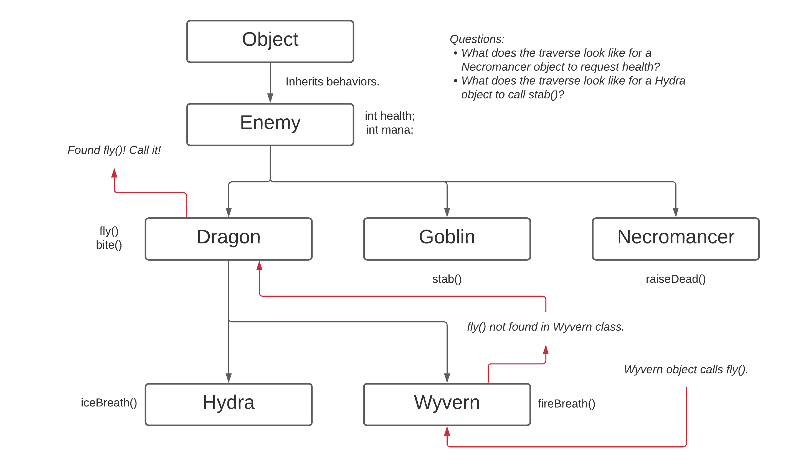

# <!-- fit --> CS 199 EMP

### Hosted by Jackie Chan and Akhila Ashokan

**Topics:** Inheritance Cont., Polymorphism, and Upcasting/Downcasting Mechanics

---

# Today's Learning Objectives
- Inheritance Cont.

- Polymorphism

- Upcasting, Downcasting

- `instanceof`

- `@Override`

Write code on the homepage or any playground on the site!
https://cs125.cs.illinois.edu/

Slides are on the course site!
https://cs199emp.netlify.app/

---

# Brief Review of Inheritance

*Inheritance* is the ability for an object to *inherit* behaviors (both methods and states) from a *parent object*.

```java
class Enemy { // Enemy is the parent class.
  int health;
  int maxHealth;
  int mana;
  int maxMana;
}

class Witch extends Enemy { // Witch is the child class.
  int castFireball() {
    mana -= 5;
    int damage = maxHealth * 5;
    return damage;
  }
}
```

---

# Practice with Inheritance (5 minutes)

1. Why is inheritance valuable?

2. What are some situations that are ideal for inheritance?

3. Are `private` fields and functions available to children?

---

# `Object`: The Common Ancestor

Remember, that all objects have a common ancestor! All objects, despite it not be explicit, inherit behaviors from the `Object` class. The most prevalent of them is `myObject.toString()`.

Whenever you call a function/variable within an object, Java will traverse the family tree from child all the way up to `Object` to find it.

On the next slide, you'll practice these ideas with the `Enemy` class again! *About 5 minutes on the next slide.*

---



---

# Polymorphism, Excuse Me?

*Polymorphism* is the idea that objects can *morph* into multiple (hence the *poly*) different objects.

```java
// Pet is a Object
class Pet { }

// Dog is a Pet
// Dog is a Object
class Dog extends Pet { }

// Mutt is a Dog
// Mutt is a Pet
// Mutt is a Object
class Mutt extends Dog { }
```
---

# Practice with Polymorphism (5 minutes)

Given this code, answer the questions:

```java
class FlyingObject { }
class UFO extends FlyingObject { }
class Airplane extends FlyingObject { }
class JetLiner extends Airplane { }
class AirbusA380 extends JetLiner { }
class Missile extends FlyingObject { }

// What objects are acceptable for these functions?
void foo(Object o) { }
void voo(JetLiner j) { }
void too(UFO u) { }
void woo(FlyingObject f) { }
```

---

# Upcasting and Downcasting

*Upcasting is easy*. Java can figure it out, consider this:
```java
FlyingObject myPrivateJet = new JetLiner();
```

*Downcasting is annoying.*
```java
FlyingObject myPrivateJet = new JetLiner();

if (myPrivateJet instanceof JetLiner) { // Check if downcasting is possible.
  JetLiner jet = (JetLiner) myPrivateJet; // Downcasting.
  // Now I have access to JetLiner unique fields and methods.
  jet.flyLuxuriously();
}

// Does the same thing.
if (myPrivateJet instanceof JetLiner jet) {
  jet.flyLuxuriously();
}

```

---

# Practice with Upcasting/`instanceof`/`@Override`

Here, we'll be comparing `Enemy` objects. Two enemies are equal to each other if they have the same `maxHealth` and `maxMana`. Write a `equals()` function in the `Enemy` class to compare different enemies.

---

# Starter Code (10 minutes)

```java
class Enemy {
  int maxHealth;
  int maxMana;

  // some annotation here
  boolean equals(Object o) {

    // check if o is an instance of an Enemy.

    // cast and check maxHealth and maxMana.

  }
}

class Dragon extends Enemy { }
class Griffin extends Enemy { }

Dragon d = new Dragon();
d.maxHealth = 100;
d.maxMana = 200;

Griffin g = new Griffin();
g.maxHealth = 100;
g.maxMana = 200;

// Should print out true.
System.out.println(d.equals(g));
```

---

# Copying Practice: Goblin Army! (5 minutes)

Write a copy constructor that will copy a given `Goblin` object.

```java
class Goblin {
  String clan;
  String weapon;
  Goblin(Goblin c) {
    // Your code here.
  }
}

int armySize = 100;
Goblin original = new Goblin();
original.clan = "Highlands";
original.weapon = "Spear";

Goblin[] army = new Goblin[armySize];

for (int i = 0; i < armySize; i++) {
  army[i] = new Goblin(original);
}
```
---

# Holy Moly We Covered A Lot! Let's Summarize.

We covered these ideas:

1. What is inheritance, and why it's important.

2. What is polymorphism, what does it allow us to do?

3. How to do upcasting and downcasting, `instanceof`, and `@Override`.

4. How to copy objects using constructors.

Any questions about any of this?

---

# Great! You made it to the end of the week.

Have a good weekend. Give us some feedback if you like, and we hope you have an amazing weekend.

---

# Solutions Section

---

# Inheritance Answers

1. Inheritance allows us to reuse code by inheriting behaviors from parent objects. Reducing the amount of code causes fewer errors and allows us to change behavior for a family of children objects.

2. Think about `Car` objects and particular types of cars, e.g. `Racecar`, `Truck`, etc. Other situations may be `Building` and `Skyscraper`, `Library`, and `House` as the children.

3. `private` fields and functions are not available for children. `protected`, `public`, and default are all available to children.

---

# Enemies Answers

1. `Necromancer` will look for a health variable in its own class, `Necromancer`, and not find it. It'll go up, check the `Enemy` class and find the health variable.

2. `Hydra` will look for the `stab()` function within itself, then in `Dragon, `Enemy`, and finally `Object` and not find it. It will result in an error.

---

# Polymorphism Answers

```java
// Runs with everything. All objects are Objects.
void foo(Object o) { }

// Runs with JetLiners and AirbusA380 because AirbusA380
// *is a* JetLiner too.
void voo(JetLiner j) { }

// Only runs with UFO objects.
void too(UFO u) { }

// Runs with all children because objects like Missiles *are*
// FlyingObjects too through polymorphism.
void woo(FlyingObject f) { }
```

---

# Upcasting/`instanceof`/`@Override` Solution
```java
class Enemy {
  int maxHealth;
  int maxMana;

  @Override
  public boolean equals(Object o) {

    if (o instanceof Enemy) {
      Enemy e = (Enemy) o;
      
      if (e.maxHealth == this.maxHealth && e.maxMana == this.maxMana) {
        return true;    
      }
      
    }
    
    return false;

  }
}
```

---

# Goblin Army Solution

```java
class Goblin {

  String clan;
  String weapon;

  Goblin(Goblin c) {
    this.clan = c.clan;
    this.weapon = c.weapon;
  }

}
```