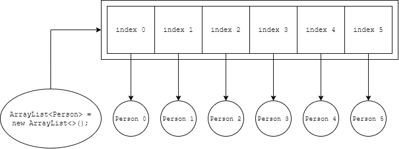
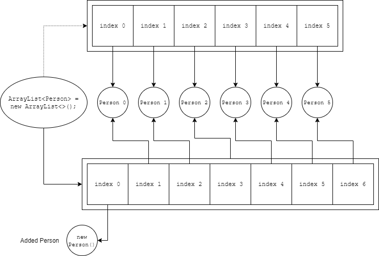
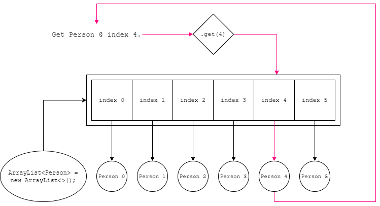
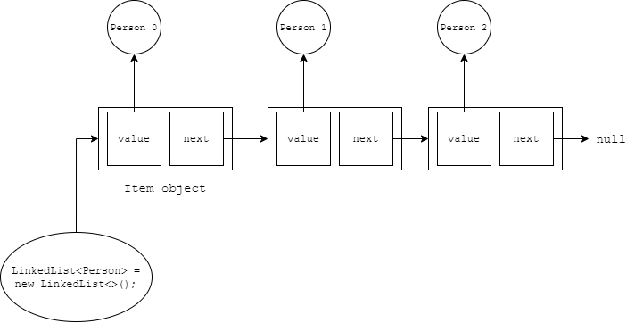
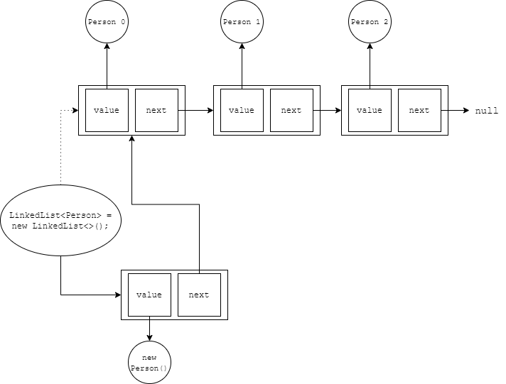
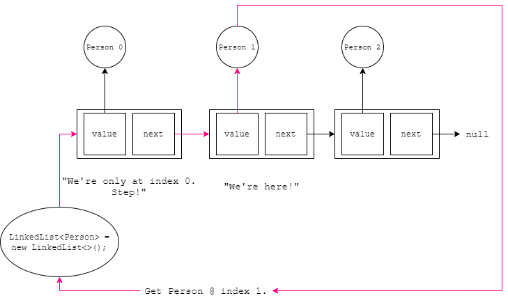

# <!-- fit --> CS 199 EMP

### Hosted by Jackie Chan and Akhila Ashokan

**Topics:** Linked Lists,

MORE on Anonymous Classes and Interfaces, MORE on Lambda Expressions, MORE on Algorithm Analysis

---

# Resources

Removed the poor learning objectives.

Write code on the homepage or any playground on the site!
https://cs125.cs.illinois.edu/

Slides are on the course site!
https://cs199emp.netlify.app/

---

# Let's Talk About ArrayLists Before

*How do they look under the hood?*

Let's remember the operations we should expect from a List. Then we'll look at how `ArrayList` implements those.

For a list, we should expect these operations on ordered elements:

- **Add:** Add an element to the list, say at the beginning.

- **Remove:** Remove an element at a particular index.

- **Get:** Get a particular element from the list.

Let's focus on these. How are they implemented? How fast? After that, we'll look into Linked Lists.

---

# Adding to an `ArrayList`.

Consider this `ArrayList`.

---



---

# Now let's add something to it.

---



---

# That was very annoying.

*Because the array was at a fixed size*, and it couldn't fit another element, we needed to nudge everything down to add an element to the beginning.

That operation is $O(n)$ because it needed to initialize a new array $O(1)$, then add $n$ elements down one index $O(n)$, and finally add the new element $O(1)$.

We'll later see that this is *drastically faster* for linked lists.

Removing an element at a particular index is also equally painful.

---

# Let's take a look at the get operation for `ArrayList`.

Consider the same initial `ArrayList` previously.

---



---

# That was less painful.

Getting an object is fast in an `ArrayList` because you can just access the specific element based on the index, $O(1)$.

We'll later lose that luxury in `LinkedList`.

---

# Questions?

Any questions about `ArrayList`? Lots to visualize, hopefully those diagrams were helpful.

*Let's now move onto those operations with a linked list instead.*

---

# Adding to a `LinkedList`.

Consider this `LinkedList`.

---



---

# `LinkedList` is a chain of `Item` objects in this case.

Each `Item` object has two values, a reference to a `Person` and a reference to the next `Item`.

```java
class Item {
  Person value;
  Item next;
}
```

We only know it's the end of the list when the `next` value is `null`.

Now, let's actually add a person to `LinkedList` to the start.

---



---

# BANG! That was fast.

This is a constant time operation. We know this because adding an `Person` to the list is a fixed number of steps no matter the size of the `LinkedList`.

Remember, from `ArrayList`, it was linear time $O(n)$.

Nice! *Now, what about retrieving an element.*

---



---

# Compared to `ArrayList`, that was painful.

In `ArrayList`, getting an object at a particular index was constant time $O(1)$.

Here, worse-case scenario the element you're looking for is at the end, thus the runtime is linear $O(n)$.

Remember, this is called *walking through the list*.

---

# Pause for a moment.

I spoke for awhile.

`ArrayList` and `LinkedList` are *two different implementations* of lists. They have their tradeoffs.

Any questions here before we practice?

---

# Linked List Practice (15 minutes)

*Printing a `LinkedList`.* I'll give you code for a `LinkedList`, can you override the `toString()` method? Convert the `LinkedList` to a `String` in an elegant way.

---

# Printing `LinkedList` Starter Code

```java
public class LinkedList {

  private Item start;

  class Item {
    public String name;
    public Item next;
    
    Item(String setName, Item setNext) {
      this.name = setName;
      this.next = setNext;
    }
  }
  
  public void add(String s) {
    Item addition = new Item(s, this.start);
    this.start = addition;
  }

}

LinkedList ls = new LinkedList();
ls.add("First");
ls.add("Second");
ls.add("Third");
System.out.println(ls); // This should work.
// Would be nice to have: Third -> Second -> First -> null
```

---

# `LinkedList` Replace (10 minutes)

Let's try lambda expressions and pass in a filter method that replaces a name with `[replaced]` if flagged by the expression.

For example, `(i) -> !i.name.equals("Jackie");` should replace all `"Jackie"` strings in the `LinkedList` with `[deleted]`.

---

# Replace `LinkedList` Starter Code

Add this functional interface.

```java
interface Replace {
  boolean replace(String i);
}
```

And this function within `LinkedList`.

```java
public void replace(Replace r) {
  // Your code here.
}
```

This should work by the end.

```java
ls.replace((s) -> s.equals("First"));
System.out.println(ls);
```

---

# Personal Wisdom

Using a while loop will be helpful (at least for now, stay tuned) to *walk through* a `LinkedList`.

```java
while (i != null) {
  // Some code.

  // Move on.
  i = i.next;

}
```

If you don't do this right, then it'll loop forever. Make sure you get this right. *Note: You want a while loop because you don't know the size of the `LinkedList`, only where it starts.*

Also, draw it. It's *difficult* to imagine all these moving parts in your head.

---

# `LinkedList` Add to End (10 minutes)

Add this function into `LinkedList` that adds a `String` to the end.

```java
public void addToEnd(String s) {
  // Your code here.
}
```

Remember that you have the print function to test.

---

# Improve Add to End (5 minutes)

Add a variable called `Item last;` that denotes the last elememt in the `LinkedList`.

Add this snippet to the immediately after `additional` declaration in the `add(String s)` function.

```java
if (this.start == null) {
  this.end = addition;
}
```

Rewrite the `addToEnd(String s)` function now that you have the `last` variable.

---

# Holy cow that was a lot about `LinkedList`

Congrats! You're now full-blown experts! Only $\infty$ more data structures to go, kidding (late April Fools')!

The moral of the story, data structures are cool. There are a lot of them. They're used for different purposes.

Knowing them will allow you to not reinvent the wheel each time and write efficient code.

Upcoming, my (Jackie's) favorite data structure, maps!

---

# Solution Section

---

# Print `LinkedList` Solution

```java
@Override
public String toString() {
  Item i = this.start;
  String output = "";
  
  while (i != null) {
    output += i.name + " -> ";
    i = i.next;
  }

  return output + "null";
}
```

---

# Replace `LinkedList` Solution

```java
public void replace(Replace r) {
  Item i = this.start;

  while (i != null) {
    if (r.replace(i.name)) {
      i.name = "[replaced]";
    }
    i = i.next;
  }
}
```

---

# `LinkedList` Add to End Solution

```java
public void addToEnd(String s) {
  Item i = this.start;

  // Walk to the end.
  while (i.next != null) {
    i = i.next;
  }

  i.next = new Item(s, null);
}
```

---

# `LinkedList` Add to End Faster Solution
```java
public void addToEnd(String s) {
  this.last.next = new Item(s, null);
  this.last = last.next;
}
```