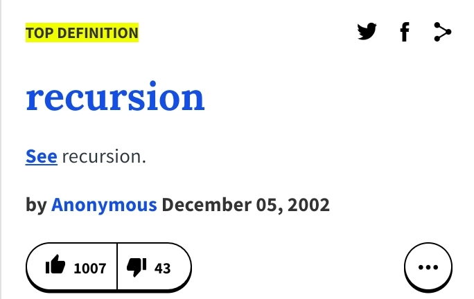
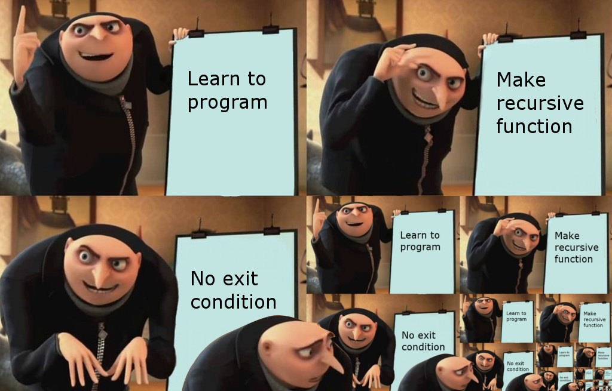

---

# <!-- fit --> CS 199 EMP

### Hosted by Jackie Chan and Akhila Ashokan

**Topics:** [Recursion](https://cs199emp.netlify.app/dist/s21/2021-04-16.html#2)

---

# Resources

**A new tool in your toolkit!** An extension to for-loops and while-loops.

Write code on the homepage or any playground on the site!
https://cs125.cs.illinois.edu/

Slides are on the course site!
https://cs199emp.netlify.app/

---

# What is Recursion?

*My Definition:* Recursion is a *problem solving method* by continuously breaking it down into smaller instances that are trivial to solve. This is done through a function defined as smaller instances of itself.

*Wikipedia:* Recursion in computer programming is exemplified when a *function is defined in terms of simpler, often smaller version of itself*.

*Let's take a look at an example to illustrate it.*

---

# Fibonacci Numbers

Similar to factorials, [Fibonacci numbers](https://oeis.org/A000045) are defined as $F_n = F_{n-1} + F_{n-2}$ where $F_n$ is the $n$th Fibonacci number for $n > 1$ and $F_0 = 0$ and $F_1 = 1$. Here's the code for it.

```java
int fibonacci(int n) {
  if (n == 0) { // Small, trivial case, i.e. base case.
    return 0;

  } else if (n == 1) { // Small, trivial case, i.e. base case.
    return 1;

  } else { // Recursive case.
    return fibonacci(n - 1) + fibonacci(n - 2);
  }
}
```

Let's walk through it. Does that make sense?

Now, let's take a look at the iterative approach.

---

# Fibonacci Iterative Approach

```java
int fibonacci(int n) {
  if (n == 0) {
    return 0;

  } else if (n == 1) {
    return 1;

  } else { // Gross...
    int nMinusOne = 1;
    int nMinusTwo = 0;
    int value = 1;

    for (int i = 2; i < n; i++) {
      int newValue = value + nMinusOne;
      nMinusTwo = nMinusOne;
      nMinusOne = value;
      value = newValue;
    }

    return value;
  }
}
```

---

# Brief Review Over

I got like three off-by-one errors dealing with that iterative approach. Just like real life tools, there may be some instances where recursion is more elegant to solve a problem. There are going to be problems that match well with recursion. You'll get that intuition soon.

*What are you still feeling uncomfortable with? Literally anything.*

Don't worry. Recursion is difficult.

---

# Searching Through a Linked List Recursively (15 min.)

To review, here's the iterative approach.

```java
boolean contains(int value) {

  for (Item current = this.start; current != null; current = current.next) {
    if (current.value == value) {
      return true;
    }
  }
  
  return false;
}
```

I want you to solve this through recursion, I'll give you the pseudocode and starter code.

---

# Linked List Starter Code

```java
class LinkedList {
  class Item {
    int value;
    Item next;
    
    Item(int setValue, Item setNext) {
      this.value = setValue;
      this.next = setNext;
    }
  }
  
  Item start;
  
  void add(int value) {
    Item i = new Item(value, null);
    
    if (this.start == null) {
      this.start = i;
    } else {
      i.next = this.start;
      this.start = i;
    }
  }
  
  @Override
  public String toString() {
    String buffer = "";
    
    for (Item i = this.start; i != null; i = i.next) {
      buffer += i.value + " -> ";
    }
    
    return buffer + "null";
  }
}

LinkedList ls = new LinkedList();
ls.add(1);
ls.add(2);
ls.add(3);

System.out.println(ls);
```

---

# Pseudocode for Recursive Contains

```java
// Public facing function.
public boolean contains(int value) {
  return containsHelper(value, this.start);
}

// Recursive function.
private boolean containsHelper(int value, Item start) {
  if (<Is it here?>) {
    return true;
  } else {
    return <Check the rest of the list.>
  }
}
```
Test cases.
```java
System.out.println(ls.contains(4)); // False
System.out.println(ls.contains(1)); // True
```

---

# Fix This Broken Recursion (10 min.)

I tried to write a recursive solution to add up the elements of an array. Please help me fix it!

```java
import java.util.ArrayList;
import java.util.List;

int sum(ArrayList<Integer> arr) {
  return arr.get(0) + sum(arr.subList(1, arr.size() - 1));
}

List<Integer> arr = new ArrayList<>();
arr.add(1);
arr.add(2);
arr.add(3);

System.out.println(sum(arr)); // Should be six.
```

What is it missing? *Hint: _ase _ase (remaining letters: b, c).* Might be helpful to have the `.subList()` documentation open.

---

# Fibonacci Numbers Sequel: Tribonacci Numbers (15 min.)

Similar to Fibonacci numbers, Tribonacci numbers are defined as the sum of the previous *three* Tribonacci numbers where Tribonacci number $n$ when $n > 3$ is defined as $T_n = T_{n-1} + T_{n-2} + T_{n-3}$ where $T_0 = T_1 = 0$ and $T_2 = 1$.

Feel free to mimic this off of the Fibonacci number implementation previously.

You can do it :)

Here's [the sequence](https://oeis.org/A000073) if you want a reference. Index starts at zero.

---

# I hope recursion is a little less scary after today.

You'll learn to have Stockholm syndrome for recursion soon.

You're now in the known of about 50% of programming jokes, higher on `r/programminghumor`. Welcome to the club!

<style>
img[alt~="center"] {
  display: block;
  margin: 0 auto;
}
</style>



As always, have a safe and awesome weekend. You're almost to summer, hang in there.

---

# Solution Section

---

# Recursive Contains Solution

```java
// Public facing function.
public boolean contains(int value) {
  return containsHelper(value, this.start);
}

// Recursive function.
private boolean containsHelper(int value, Item start) {
  if (start.value == value) { // Check here.
    return true;
  } else { // Check the rest of the list.
    return containsHelper(value, start.next);
  }
}
```

---

# Broken Array Sum Solution

```java
import java.util.ArrayList;
import java.util.List;

int sum(ArrayList<Integer> arr) {
  if (arr.size() == 1) {
    return arr.get(0);
  } else {
    return arr.get(0) + sum(arr.subList(1, arr.size()));
  }
}

List<Integer> arr = new ArrayList<>();
arr.add(1);
arr.add(2);
arr.add(3);

System.out.println(sum(arr)); // Should be six.
```

---

# Tribonacci Number Solution

```java
int tribonacci(int n) {
  if (n == 0 || n == 1) { // Small, trivial case, i.e. base case.
    return 0;

  } else if (n == 2) { // Small, trivial case, i.e. base case.
    return 1;

  } else { // Recursive case.
    return tribonacci(n - 1) + tribonacci(n - 2) + tribonacci(n - 3);
  }
}
```