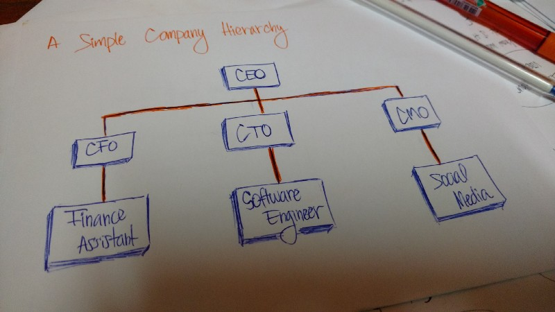
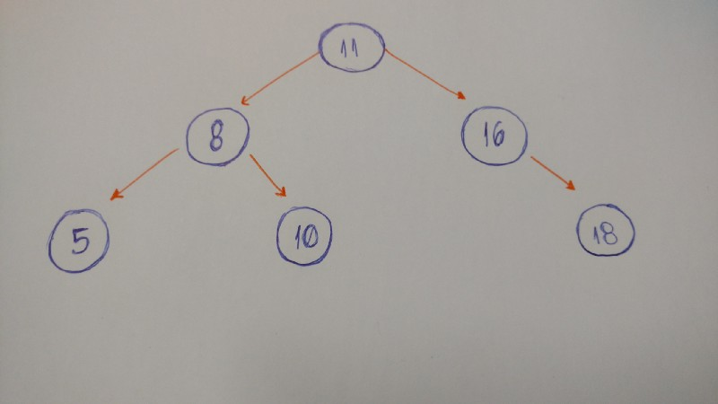

# <!-- fit --> CS 199 EMP

### Hosted by Jackie Chan and Akhila Ashokan

**Topics:** [Trees and Recursion](https://cs199emp.netlify.app/dist/s21/2021-04-20.html)

---

# Resources

Write code on the homepage or any playground on the site!
https://cs125.cs.illinois.edu/

Slides are on the course site!
https://cs199emp.netlify.app/

---

# What are Trees? What do we use them for? 

A technical definition: a collection of entities called nodes. Nodes are connected by edges and each node has a value and possible a child note. 

Real life examples: a company hierarchy, HTML document object model, a family tree 



---

# Tree Terms 

- root: fist node in the tree; usually at the top 

- parent node: any node that has an edge pointing to another node 

- child node: any node that has a parent node 

- leaf node (leaves): any node that does not a child node 

- height/depth of a tree: the distance from root node to farthest leaf node 

---

# A Special Type of Tree: Binary Tree 

---



---

# Combining Trees and Recursion 

Trees and recursion go together. Why? Because trees are defined recursively. It's much easier to solve tree problems with recursion in play. 

---

# Okay, enough talk. Let's do some practice problems! 

---

# Find the Height of Binary Tree (10 mins)

Write a function to find the height of a binary tree. Use recursion! 

```java
public class Node {
  int val;
  Node left;
  Node right;
  Node() { }
  Node(int setVal) { 
    this.val = setVal; 
  }
  Node(int setVal, Node setLeft, Node setRight) {
    this.val = setVal;
    this.left = left;
    this.right = right;
  }
}

public static int findHeight(Node root) {
  // Write your code here.
}
```

---

# Find the Sum of Left Leaves (10 mins)

Write a function finds the sum of the left leaves given the root of the tree. 

```java
public class Node {
  int val;
  Node left;
  Node right;
  Node() { }
  Node(int setVal) { 
    this.val = setVal; 
  }
  Node(int setVal, Node setLeft, Node setRight) {
    this.val = setVal;
    this.left = left;
    this.right = right;
  }
}

public int sumOfLeftLeaves(Node root) {
  // write your code here 
}
```

---

# Find a Value in a Binary Search Tree (10 mins)

Binary search trees are a special type of binary trees where the value in each node

- is greater than any value stored in the left sub-tree,

- and less than any value stored in the right sub-tree.

Write a function to find a value in the given binary search tree. 

---

# Starter Code 

```java
public class Node {
  int val;
  Node left;
  Node right;
  Node() { }
  Node(int setVal) { 
    this.val = setVal; 
  }
  Node(int setVal, Node setLeft, Node setRight) {
    this.val = setVal;
    this.left = left;
    this.right = right;
  }
}

public Node searchBST(Node root, int val) {
  // write your code here 
}
```

---

# That's all, folks! 


Thanks for stopping by today. We hope you learned alot about how useful recursion is to solve tree problems. 

Only a few more weeks to go! Hang in there everyone and enjoy the rest of your week. 

---

# Solution Section

---

# Find the Height of Binary Tree - Solution 

```java
public static int findHeight(Node root) {
  if (root == null) {
    return 0;
  }
  
  int lHeight = findHeight(root.left);
  int rHeight = findHeight(root.right);
  
  if (lHeight > rHeight) {
    return lHeight + 1;
  } else {
    return rHeight + 1;
  } 
}
```

---

# Find the Sum of Left Leaves - Solution 

```java
public int sumOfLeftLeaves(Node root) {
  if (root == null) {
    return 0;
  }
  return processSubtree(root, false);
}

private int processSubtree(Node subtree, boolean isLeft) {
        
  // Base case: This is a leaf node.
  if (subtree.left == null && subtree.right == null) {
    if (isLeft) {
      return subtree.val;
    } else {
      return 0;
    }
  }
      
  // Recursive case: We need to add and return the results of the
  // left and right subtrees.
  int total = 0;
  if (subtree.left != null) {
    total += processSubtree(subtree.left, true);
  }
  if (subtree.right != null) {
    total += processSubtree(subtree.right, false);
  }
  return total;
  
}
```

---

# Find A Value in a Binary Search Tree - Solution 

```java
public Node searchBST(Node root, int val) {
    if (root == null || val == root.val) {
        return root;
    }
      
    if (val < root.val) {
        return searchBST(root.left, val);
    } else {
        return searchBST(root.right, val);
    }
    
  }
```